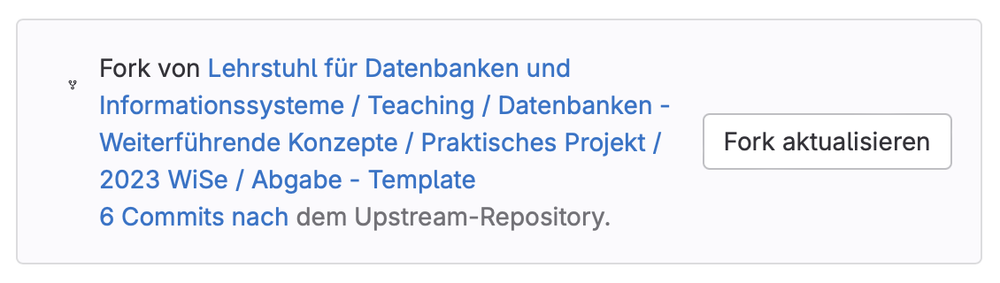

# Datenbanken: Weiterführende Konzepte – Praktisches Projekt – Abgabe

Dies ist die Vorlage zur Abgabe für das praktische Projekt im Modul "Datenbanken: Weitereführende Konzepte".

## Einrichtung

Es muss **mindestens Java 8** installiert sein.

Zur besseren Handhabung sollte dieses Repository als Gradle-Projekt in eine IDE importiert werden.

## Hinweise

Die Aufgabenstellung finden Sie im Repository des entsprechenden Blatts.

Kritische Entscheidungen zu den einzelnen Blättern listen Sie bitte in der `README` im zum entsprechenden Blatt zugehörigen Ordner auf.

Die Abgabe erfolgt bei jedem Push in Ihr Repository per CI/CD.

Der Stand Ihres Forks sollte ohne Ihre Änderungen dem Stand des Upstreams entsprechen. Ansonsten müssen Sie Ihren Fork aktualisieren.

